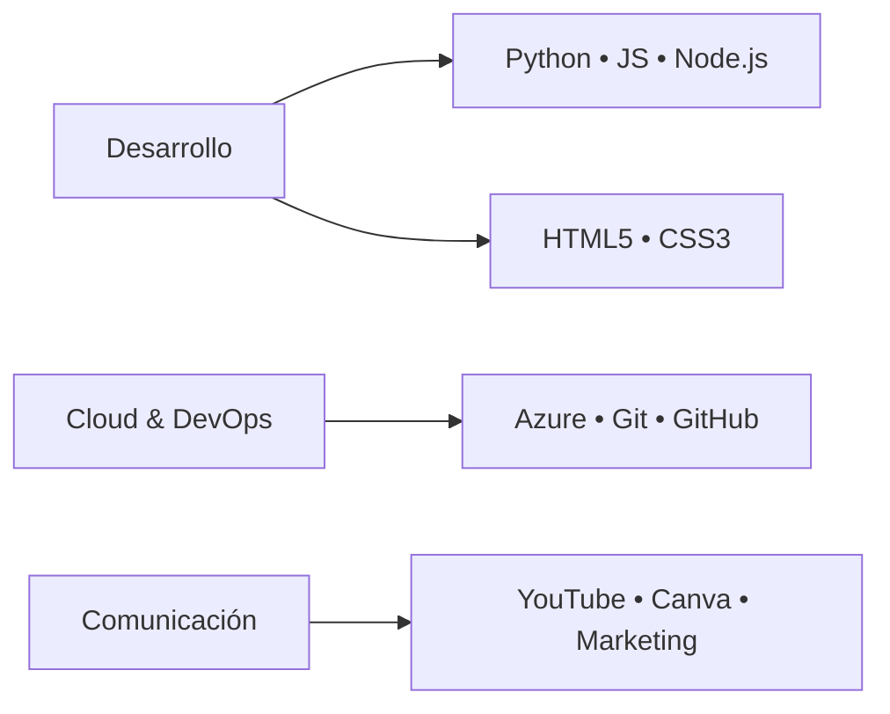

```markdown
<p align="center">
  
</p>

<div align="center">
  
  [](https://www.linkedin.com/in/samuel-esteban-sánchez-moreno-04b329359)
  [](https://www.youtube.com/@soysamdval)
  [](mailto:sam.sanchez200703@gmail.com)
  [](https://github.com/SamDVal)

  
  

</div>

---

## 🌟 Hola, soy Sam 👋

> *"Construyo puentes entre la tecnología, la humanidad y lo divino."*

Soy un **polímata en desarrollo** 🧭 que fusiona el rigor técnico del software con la sensibilidad de la comunicación y la integridad espiritual. Actualmente, creo soluciones con propósito como **Consultor TIC en RSM Colombia**.

✨ **Lo que me define:**
- 🎯 **Enfoque:** IA Ética, Azure Cloud y automatización inteligente.
- 🕊️ **Propósito:** Servir con excelencia técnica y claridad espiritual en cada proyecto.
- 🌱 **Crecimiento:** Aprendizaje continuo con base en la fe y la disciplina.

---

## 💻 Stack Tecnológico



### 🔧 Herramientas Principales
| Categoría | Tecnologías |
|-----------|-------------|
| **Backend** |   |
| **Frontend** |    |
| **Cloud & Tools** |    |
| **Creatividad** |   |

---

## 🚀 Proyectos Destacados

<div align="center">

| Proyecto | Descripción | Tecnologías | Estado |
|----------|-------------|-------------|---------|
| **NITS MVP** | Sistema de información implementado para stakeholders | Python • Azure | ✅ Completado |
| **AI Orchestration** | Agentes inteligentes para automatización empresarial | Python • Node.js | 🔄 En desarrollo |
| **Polymath Labs** | Brand personal: contenido sobre mente, cuerpo y alma | YouTube • Markdown | 🌱 Activo |

</div>

> 💡 *¿Tienes una idea? [Hablemos](mailto:sam.sanchez200703@gmail.com) sobre cómo puedo ayudarte a materializarla.*

---

## 📊 Métricas & Actividad

<p align="center">
  
  
</p>

<p align="center">
  
</p>

---

## 🎓 Formación & Certificaciones

```bash
🎓 Tecnólogo en Análisis y Desarrollo de Software  # SENA | 2024-2026

✅ Certificaciones:
   ├─ CS50x Harvard • Computer Science Fundamentals
   ├─ Microsoft Azure • Security, Identity & Compliance  
   ├─ Diplomado en Participación Ciudadana • Personería de Bogotá
   └─ Inglés Técnico B1/B2 • SENA

🔭 Próximo objetivo: Certificación Azure Developer (2026)
```

---

## 🤝 Colaboraciones & Reconocimientos

> *"Sam ha demostrado un talento excepcional para transformar ideas complejas en soluciones técnicas claras y efectivas."*  
> — Feedback de stakeholders senior en RSM Colombia

- 🏆 Reconocido por múltiples managers en RSM por excelencia en desarrollo de software e IA.
- 🤝 Colaboración exitosa con Mónica Badilla en implementación del proyecto NITS.
- 🎯 Demostraciones técnicas validadas por emprendedores y líderes de negocio.

---

## 📫 Conectemos

<div align="center">

| 💼 Profesional | 🎨 Creativo | ✉️ Contacto Directo |
|---------------|-------------|-------------------|
| [](https://www.linkedin.com/in/samuel-esteban-sánchez-moreno-04b329359) | [](https://www.youtube.com/@soysamdval) | [](mailto:sam.sanchez200703@gmail.com) |

</div>

---

<div align="center">
  <sub>
    Hecho con <code>❤️</code>, <code>disciplina</code> y <code>fe</code> por <b>Sam D Val</b><br/>
    <i>"No por la fuerza, ni por el poder, sino por mi Espíritu" — Zacarías 4:6</i>
  </sub>
</div>
```
